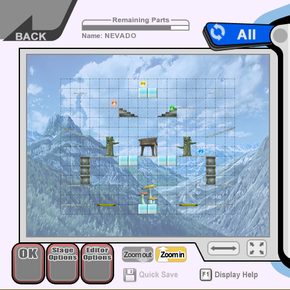
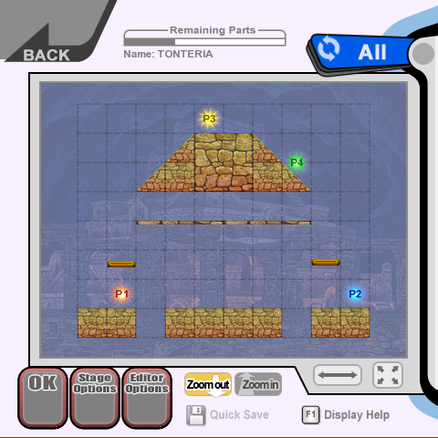
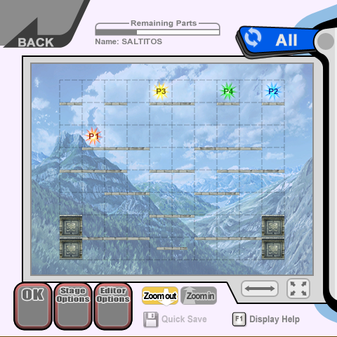
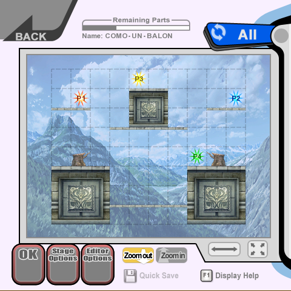

Some time ago, I was watching my boyfriend play Animal Crossing on the Switch.
He was trying to build the neighborhood from the small beach town where he and his family used to go every summer because his grandparents owned an apartment. He has soooo many childhood memories of that place, and he never shuts up about going back there every time summer gets brought up in a conversation, but after some tough family problems and the passing of his late grandma, I feel like that place has gained a lot more emotional meaning for him.

After showing me a bunch of spots on the island, he finished the tour by going to a tiny hill by the beach where he had built a tombstone that had a pine cone next to it. He told me that he used to walk around the neighborhood with his grandma to pick up pine cones and he looks back to that memory so fondly that they became some kind of memento for him.

Took me a bit to process it, but I thought that was such beautiful sight. Made me start thinking about how a digital world could have so much meaning and weight for someone, and how it could also last forever as a time capsule, a snapshot from a specific time in your life than even when lacking the context for their creation, I can't help to put myself in the other person's shoes.

With all of that out of the way, I just finished crying my eyes out after looking at some custom stages from a Super Smash Bros. Brawl save file on a Wii that I repaired today haha.

Super Smash Bros is a very important game series to me (and Brawl was the first one I owned), and I couldn't help thinking that those stages were once a fun creative moment for someone, and that now they're lost forever. I still feel so dumb by getting so gloomy about something so minor that even the original creator must have forgotten about, but I feel like sharing these stages with the world even if I'm the only one that ever see them.

Lately I've been really interested on the Wii as a system and I keep buying faulty consoles to repair, so I'll probably find more stages, pictures and replays in the future, can't wait to share them with you!

(Used [Brawl Stage Studio](https://www.gamebrew.org/wiki/Super_Smash_Bros._Brawl_Stage_Studio_Wii#External_links) so I could see the stages on my PC)

The original creator of these stages is **Rafa**, he played Brawl around 25 hours and _almost_ completed the Subspace Emisary at 75%, props to you!

# Stage 1: PAPADOPOULOS



<table>
  <tr>
    <th>
  </tr>
  <tr>
    <td colspan="2" style="text-align: center">
    Something something Spanish youtuber, if you know you know. But his is an easy 8/10.
    </td>
  </tr>
</table>



# Stage 2: NEVADO


<table>
  <tr>
    <th>
  </tr>
  <tr>
    <td colspan="2" style="text-align: center">
    I really like how all of his stages are symmetric, but this is a 6/10, too big for such little platforms to fight on!
    </td>
  </tr>
</table>


# Stage 3: TONTERIA


<table>
  <tr>
    <th>
  </tr>
  <tr>
    <td colspan="2" style="text-align: center">
    I love this one, getting to the top platform can be tricky and everyone is gonna go up there to get an advantage. 9/10!
    </td>
  </tr>
</table>


# Stage 4: SALTITOS


<table>
  <tr>
    <th>
  </tr>
  <tr>
    <td colspan="2" style="text-align: center">
    This is the worst one for sure, but it did make me laugh out loud when I saw the name. It's an inside joke I have with my boyfriend that's a reference to his bird pet jumping on stuff. 4/10...
    </td>
  </tr>
</table>


# Stage 5: COMO UN BALON


<table>
  <tr>
    <th>
  </tr>
  <tr>
    <td colspan="2" style="text-align: center">
    This one's just confusing. Is this supposed to be some kind of football field? Still a solid stage 7/10.
    </td>
  </tr>
</table>


[Here's a zip file with all 5 stages in case you want to download them](RafaBrawlStages.zip)

And that's all I got for today, hopefully I can come back with more stuff like this, I definitely want to find more lost save files and share anything interesting here. 
