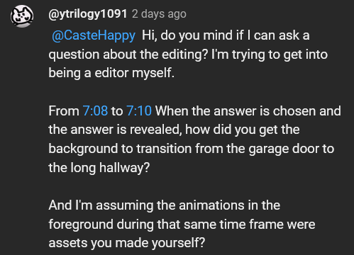
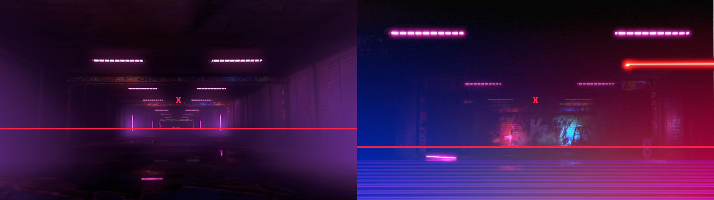
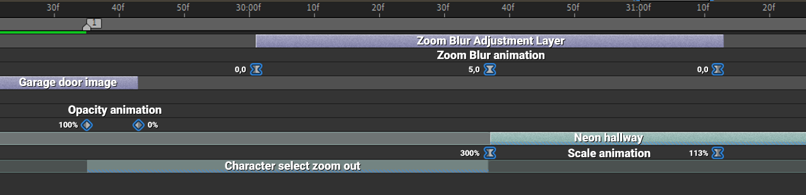

I was asked by **ytrilogy1091** on Youtube about how I made this transition from [one of the latest videos I've uploaded to Diaphone's channel](https://www.youtube.com/watch?v=dmHg8T8IMuw):


<video width=100% controls>
    <source src="transition1.webm" type="video/webm">
    Your browser does not support the video tag.  
</video>


This is the actual question:

Everything in the foreground I made it myself, I've already talked about the "rank reveal" animation [in this post](/portfolio/SF6RankUp/).

For the zoom out animation, I just needed 2 files, a still image of the garage door background that appears when choosing characters, and a video of the transition that plays between choosing a stage and going to character select.

For the screnshot I disabled the HUD and used a free camera mod to get closer to the actual door so I could use it by itself as a transition (closing the door) without having to zoom in and losing quality.

The video is not modified at all, I only disabled the HUD and just let it play until the characters show up


<video width=100% controls>
    <source src="animation1.webm" type="video/webm">
    Your browser does not support the video tag.  
</video>


# Step 1: Separate the 2 parts of the animation
So the first step is to reverse the video clip so it starts at the garage door, and ends at the long hallway with neon lights.
If you've noticed, there isn't really a smooth transition from the hallway to the character select garage door, but the in-game graphics hide it really well, and that's kind of the secret of the transtion.

So after reversing the clip, I cut it into 2 different tracks, one for the zoom animation (Track 2), and one for the hallway animation (Track 1).


<table>
  <tr>
    <th>
    <video width=100% controls>
        <source src="step1.webm" type="video/webm">
        Your browser does not support the video tag.  
    </video>
    </th>
  </tr>
  <tr>
    <td colspan="2" style="text-align: center">
    I scaled up the first clip so it exactly matches the size of the screenshot, but it's irrelevant for the effect we want.
    </td>
  </tr>
</table>


The problem here is that the hallway animation always moves at the same speed, so I'll need to fake the movement so it matches the speed of the zoom out of the first clip.

# Step 2: Position the clips correctly
Now I need to align the position of both clips. As you maybe have noticed, the perspective makes it so the end of the first clip and the end of the second one, don't match at all. The scale is also completely off.



<table>
  <tr>
    <th>
  </tr>
  <tr>
    <td colspan="2" style="text-align: center">
    "X" is the center of the image, the red line is where the floor starts.
    </td>
  </tr>
</table>



So I'm gonna change the position and scale of the clip on track 1, so I get similar looking frames. Doesn't have to perfectly match.


<table>
  <tr>
    <th>
    <video width=100% controls>
        <source src="comparison.webm" type="video/webm">
        Your browser does not support the video tag.  
    </video>
    </th>
  </tr>
  <tr>
    <td colspan="2" style="text-align: center">
    A good visual reference is the size of the neon lights in both frames
    </td>
  </tr>
</table>


So now it's looking like this:

<video width=100% controls>
    <source src="step2.webm" type="video/webm">
    Your browser does not support the video tag.  
</video>


# Step 3: The actual zoom out
At this point, the last step is to fake the movement of the second clip so it matches the speed of the zoom out animation of the first one.
We can get this done with a simple scale animation.

Right now the scale value of the hallway clip is 300%, I'll add a keyframe at the very first frame (300%), and another one 35 frames later with a value of 113%.
Keyframe velocity is really important here, I'll make it so it starts scaling down really fast, but smoothly stops at the end.


<table>
  <tr>
    <th>
    <video width=100% controls>
        <source src="zoomout1.webm" type="video/webm">
        Your browser does not support the video tag.  
    </video>
    </th>
  </tr>
  <tr>
    <td colspan="2" style="text-align: center">
    Included how the velocity curve looks like just in case it's helpful.
    </td>
  </tr>
</table>


And that's pretty much it, now if you play the full clip it looks pretty convincing.


<video width=100% controls>
    <source src="zoomout2.webm" type="video/webm">
    Your browser does not support the video tag.  
</video>


If it looks off, just play around with the distance between the 2 keyframes and the velocity curves until it looks somewhat seamless.

# Step 4: Hide in plain sight

The only thing left to do now is to **lie** in order to better sell the effect. I added a third track for the still image of the garage door, and animated its opacity so it transitions into the first clip.


<video width=100% controls>
    <source src="step4-1.webm" type="video/webm">
    Your browser does not support the video tag.  
</video>


Then I added a fourth track with an adjustment layer, so I could add a Zoom blur effect that starts and ends at the same time as the actual "zoom out" we stitched together.


<table>
  <tr>
    <th>
    <video width=100% controls>
        <source src="step4-2.webm" type="video/webm">
        Your browser does not support the video tag.  
    </video>
    </th>
  </tr>
  <tr>
    <td colspan="2" style="text-align: center">
    This zoom effect also hides any imperfection, like the awful quality at the start of the second clip for example. Or any possible misalignments.
    </td>
  </tr>
</table>


And that's the final result, this is how the actual timeline looks like:

As I said at the beginning, this is actually a really simple and common transition that sadly a lot of people overuse and spam at every opportunity they get lol (I used to be guilty of this as well), but this is the actual solution for getting the effect to look smooth and somewhat convincing.

I'm not used to making tutorials and English is not my first language so sorry if this was too much, or a bit confusing. Tried to explain it for someone that's a beginner.
Also you can just follow the exact same steps in every editing software if you understand how it works.
